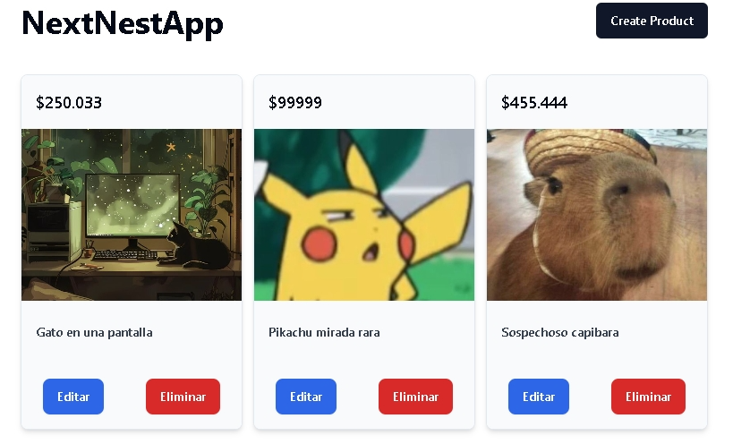

# Proyecto CRUD Full-Stack con Next.js y NestJS

Este proyecto es una aplicación full-stack CRUD, construida con **Next.js** para el frontend y **NestJS** para el backend. La aplicación permite crear, leer, actualizar y eliminar (CRUD) datos, utilizando una arquitectura separada para el frontend y backend. El propósito de este proyecto es demostrar la implementación de un CRUD utilizando tecnologías modernas y escalables como **React**, **Next.js**, **NestJS** y **Prisma**.

## Estructura del Proyecto

El proyecto está dividido en dos carpetas principales:

- **`frontend/`**: Contiene el código del cliente, construido con **Next.js** y estilizado con **Tailwind CSS**.
- **`backend/`**: Contiene el código del servidor, construido con **NestJS** y utilizando **Prisma** para la conexión a la base de datos.

## Tecnologías Utilizadas

### Frontend (Next.js)

- **Next.js (v14.2.13)**: Framework de React para aplicaciones del lado del cliente y servidor.
- **React (v18)**: Librería de JavaScript para construir interfaces de usuario.
- **Tailwind CSS (v3.4.1)**: Framework de CSS para diseño responsivo y utilidades predefinidas.
- **React Hook Form (v7.53.0)**: Librería para el manejo de formularios en React.
- **Lucide React (v0.445.0)**: Iconos modernos para React.
- **Radix UI**: Componentes de interfaz de usuario accesibles.

### Backend (NestJS)

- **NestJS (v10.0.0)**: Framework de Node.js para construir aplicaciones del lado del servidor.
- **Prisma (v5.19.1)**: ORM para interactuar con la base de datos de forma eficiente.
- **Swagger**: Herramienta para generar la documentación de la API automáticamente.
- **RxJS (v7.8.1)**: Biblioteca para manejo de programación reactiva.
- **Class-validator y Class-transformer**: Utilizadas para la validación y transformación de datos.

## Instalación

### Requisitos previos

- **Node.js** v18 o superior
- **npm** o **yarn**
- **Mysql/SqlLite** u otro sistema de base de datos compatible con Prisma

## Vista Previa

